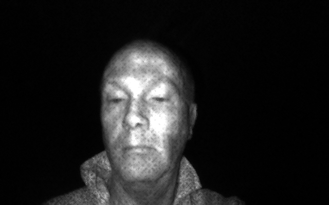

# Payne Speck Removal

If you are using the NIR (Near Infrared) sensor data from an Orbbec Seagull (aka Haiyan aka 海燕) camera unfortunately the data you receive will have a dotted/speck pattern like in the image below. This kind of pattern makes it very difficult to detect if an object is flat or 凸凹 (dekoboko). In order to smooth the data I have written an algorithm I'm calling Payne Speck Removal using OpenCV. For details of how it works please refer to the comments in the sources <a href="./src/swift/PayneSpeckRemoval.swift">here</a> and <a href="./src/java/PayneSpeckRemoval.java">here</a>

#### Raw sensor data


#### After applying Payne Speck Removal



### Swift sample code

```swift
let rawDataFile = "nir-test-data.bin"
let (before, after) = payneSpeckRemoval(rawDataFile, 400, 640)
outputNirDataAsGrayscaleImage(before, rawDataFile + "-before.png", .normalizeMinMax)
outputNirDataAsGrayscaleImage(after, rawDataFile + "-after.png", .normalizeMinMax)
```

### Java sample code

```java
String rawDataFile = "nir-test-data.bin";
Pair<Mat, Mat> beforeAfter = PayneSpeckRemoval.payneSpeckRemoval(rawDataFile, 400, 640);
PayneSpeckRemoval.outputNirDataAsGrayscaleImage(beforeAfter.first, rawDataFile + "-before.png", NormalizeMinMax);
PayneSpeckRemoval.outputNirDataAsGrayscaleImage(beforeAfter.second, rawDataFile + "-after.png", NormalizeMinMax);
```
